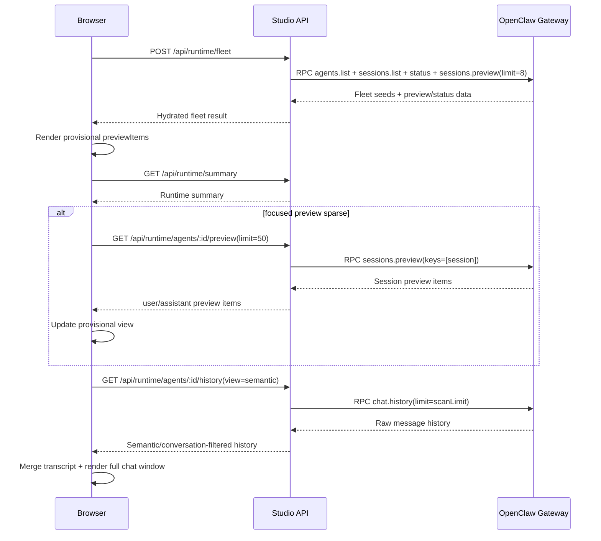

# Message Loading and Latency in OpenClaw Studio

Last updated: 2026-03-05

## Purpose
This document explains how chat messages are loaded and rendered in OpenClaw Studio, why latency happens, and where the current bottlenecks are.

It is intended for Studio developers and future agents working on message-loading performance.

## Scope and Constraints
- Scope: OpenClaw Studio (`~/openclaw-studio`) message-loading pipeline.
- Dependency: OpenClaw runtime/gateway (`~/openclaw`).
- Hard constraint: We do not modify `~/openclaw` from this repo.

## High-Level Architecture
There are three layers involved in message loading:

1. Browser/UI layer (React): selects an agent, renders provisional content, then hydrates transcript.
2. Studio API layer (`/api/runtime/*` routes): translates UI requests into control-plane/gateway calls, applies local filtering/caching.
3. OpenClaw gateway layer (`~/openclaw`): reads session files and serves `sessions.preview` and `chat.history`.

## Core Code Paths

### Browser bootstrap and fleet hydration
- `src/app/page.tsx`
  - `loadAgents()` calls `runStudioBootstrapLoadOperation()`.
- `src/features/agents/operations/studioBootstrapOperation.ts`
  - POSTs `/api/runtime/fleet`.
- `src/app/api/runtime/fleet/route.ts`
  - Calls `hydrateAgentFleetFromGateway()`.
- `src/features/agents/operations/agentFleetHydration.ts`
  - Loads `agents.list`, `sessions.list`, `status`, `sessions.preview`.
  - Fleet preview defaults: `limit=8`, `maxChars=240`.

### Summary preview patching into UI state
- `src/features/agents/state/runtimeEventBridge.ts`
  - `buildSummarySnapshotPatches()` sanitizes preview items to `user|assistant` and stores:
    - `previewItems`
    - `latestPreview`
    - `lastUserMessage`

### Provisional render before transcript hydration
- `src/features/agents/components/AgentChatPanel.tsx`
  - If transcript is empty, renders provisional conversation from `previewItems`.
  - Fallbacks to `lastUserMessage` + `latestPreview` when `previewItems` is empty.

### Focused preview recovery for sparse provisional state
- `src/features/agents/operations/useRuntimeSyncController.ts`
  - If focused agent has no history and fewer than 4 provisional items, fetches deeper preview.
- `src/app/api/runtime/agents/[agentId]/preview/route.ts`
  - Calls gateway `sessions.preview` for one session with up to `limit=50`.
  - Filters to conversation items only (`user|assistant`) and normalizes assistant text.
- `src/lib/controlplane/domain-runtime-client.ts`
  - `loadDomainAgentPreviewWindow()` client wrapper.

### Transcript hydration
- `src/features/agents/operations/useRuntimeSyncController.ts`
  - `loadAgentHistory()` calls `loadDomainAgentHistoryWindow()`.
  - Bootstrap history is capped to 12 turns (`BOOTSTRAP_HISTORY_LIMIT=12`).
  - `includeThinking/includeTools` depends on `showThinkingTraces`.
- `src/lib/controlplane/domain-runtime-client.ts`
  - `loadDomainAgentHistoryWindow()` client wrapper.
- `src/app/api/runtime/agents/[agentId]/history/route.ts`
  - Calls gateway `chat.history`.
  - Applies semantic window selection and optional conversation-only compaction.
  - Caches by `(agentId, sessionKey, view, limits, include flags)` + agent revision:
    - TTL: 20s
    - max entries: 48
    - in-flight coalescing enabled.

## What Happens on Browser Refresh

### Step-by-step flow
1. Page mounts and establishes runtime sync orchestration.
2. `loadAgents()` runs startup bootstrap.
3. Studio calls `POST /api/runtime/fleet`.
4. Fleet route asks gateway for `sessions.preview` (fleet-wide, `limit=8`) and status.
5. UI state is hydrated with agent seeds and summary patches.
6. Chat panel renders provisional items immediately from `previewItems` if transcript is still empty.
7. Runtime sync for focused agent starts:
   - Fetches `/api/runtime/summary`.
   - If preview is sparse (`<4 items`), calls focused `/api/runtime/agents/:agentId/preview?limit=50`.
8. Focused agent bootstrap history request runs (`/api/runtime/agents/:agentId/history`, semantic).
9. History response merges into transcript entries and replaces provisional-only view.
10. User can request more via "Load more" (higher turn limit).

### Sequence diagram

## How Studio Uses `~/openclaw`

Studio does not read transcript files directly. It always goes through runtime/gateway RPC.

### Preview path in OpenClaw
- `~/openclaw/src/gateway/server-methods/sessions.ts` (`sessions.preview`)
- `~/openclaw/src/gateway/session-utils.fs.ts` (`readSessionPreviewItemsFromTranscript`)

Key behavior:
- Tail-oriented read from transcript candidates.
- Max preview items bounded to 50.
- This path is generally much cheaper than full history.

### History path in OpenClaw
- `~/openclaw/src/gateway/server-methods/chat.ts` (`chat.history`)
- `~/openclaw/src/gateway/session-utils.fs.ts` (`readSessionMessages`)

Key behavior:
- Reads full transcript file (`fs.readFileSync`) and parses line-by-line JSON.
- Only then slices to requested limit.
- This is the dominant latency source for large transcripts.

## Current Strategy (Today)
The Studio strategy is staged and pragmatic:

1. Fast provisional first paint from preview snapshots.
2. Focused deep preview fallback (`limit=50`) when initial preview is too sparse.
3. Bootstrap history with smaller initial turn cap (12) to reduce first hydration cost.
4. Keep thinking/tool payloads excluded by default unless traces are enabled.
5. Use route-level cache + in-flight coalescing for repeated history requests.

## Why We Still See Blockers

### Blocker 1: "limit=8" but only 1 message appears
Root cause:
- Preview limit counts recent transcript entries, not guaranteed conversation turns.
- If recent tail is mostly tool/thinking/system, filtering to `user|assistant` can collapse to 1.

Even deep focused preview (`limit=50`) can still produce very few conversation items if the recent tail is highly non-conversational.

### Blocker 2: Initial preview appears, then full load is slow
Root cause:
- Full hydration depends on `chat.history` in OpenClaw.
- `chat.history` uses full-file read/parse before slicing.
- Requested turn count helps some, but large transcript size still dominates cost.

## Bottlenecks (Ordered by Impact)
1. OpenClaw `chat.history` full transcript read/parse cost.
2. Preview tail role skew (many non-conversation entries near tail).
3. Cold refresh path still requires at least one history hydration before transcript is complete.
4. Runtime disconnected/degraded states add variance and noise to measured latencies.

## Instrumentation and Diagnostics

### Probe scripts
- `npm run probe:agent-latency`
  - `scripts/probe-agent-history-latency.mjs`
  - Probes:
    - `/api/runtime/summary`
    - `/api/runtime/agents/:agentId/history?...view=semantic&turnLimit=50&scanLimit=800`

### Persisted logs (gitignored)
- `.agent/local/latency-probes/probe-agent-latency-runs.jsonl`
- `.agent/local/latency-probes/probe-agent-latency-latest.json`
- Additional local experiment logs can live in the same directory.

### Debug flags
- `NEXT_PUBLIC_STUDIO_TRANSCRIPT_DEBUG=1`
  - Enables transcript and history-route debug metric logging.

## Practical Implications for Future Work
Given the no-openclaw-modification constraint, Studio-side performance work should focus on:

1. Better first paint quality without waiting for full history.
2. More resilient preview fallback logic when conversation density is low.
3. Minimizing blocking dependence on slow full-history hydration.
4. Local caching/persistence strategies that avoid cold-start re-hydration costs.

Any proposal that assumes cheap random access or conversation-only retrieval from OpenClaw transcript files should be treated as invalid unless the upstream OpenClaw behavior changes.
