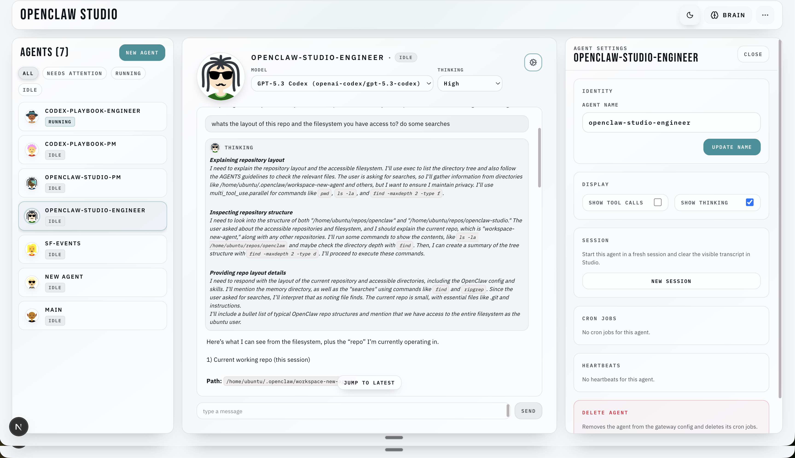

# rocCLAW

A clean web dashboard for OpenClaw. Use it to connect to your Gateway, see your agents, chat, manage approvals, and configure jobs from one place.

⭐ Drop a star to help us grow! ⭐ 

It helps more developers discover the project.

## Get Started (Pick Your Setup)

If your Gateway is already running, pick the scenario that matches where your Gateway and rocCLAW will run:

- [A. Gateway local, rocCLAW local (same computer)](#a-gateway-local-rocclaw-local-same-computer)
- [B. Gateway in the cloud, rocCLAW local (your laptop)](#b-gateway-in-the-cloud-rocclaw-local-your-laptop)
- [C. rocCLAW in the cloud, Gateway in the cloud](#c-rocclaw-in-the-cloud-gateway-in-the-cloud)

All setups use the same install/run path (recommended): `npx -y rocclaw@latest`

Two links matter:

1. Browser -> rocCLAW
2. rocCLAW -> Gateway

`localhost` always means "the rocCLAW host." If rocCLAW and OpenClaw share a machine, the upstream should usually stay at `ws://localhost:18789` even when that machine is a cloud VM.

## Requirements

- Node.js 20.9+ (LTS recommended)
- An OpenClaw Gateway URL + token, or a local OpenClaw install rocCLAW can detect
- Tailscale (optional, recommended for remote access)

## A) Gateway local, rocCLAW local (same computer)

```bash
npx -y rocclaw@latest
cd rocclaw
npm run dev
```

1. Open http://localhost:3000
2. In rocCLAW, set:
   - Upstream URL: `ws://localhost:18789`
   - Upstream Token: your gateway token (for example: `openclaw config get gateway.auth.token`)

## B) Gateway in the cloud, rocCLAW local (your laptop)

Run rocCLAW on your laptop as above, then set an upstream URL your laptop can reach.

Recommended (Tailscale Serve on the gateway host):

1. On the gateway host:
   - `tailscale serve --yes --bg --https 443 http://127.0.0.1:18789`
2. In rocCLAW (on your laptop):
   - Upstream URL: `wss://<gateway-host>.ts.net`
   - Upstream Token: your gateway token
3. Keep in mind:
   - rocCLAW still needs a gateway token here, even if the OpenClaw Control UI can use Tailscale identity headers
   - Raw `ws://<private-ip>:18789` is an advanced/manual path and may need extra OpenClaw origin configuration

Alternative (SSH tunnel):

1. From your laptop:
   - `ssh -L 18789:127.0.0.1:18789 user@<gateway-host>`
2. In rocCLAW:
   - Upstream URL: `ws://localhost:18789`

## C) rocCLAW in the cloud, Gateway in the cloud

This is the "always-on" setup. When rocCLAW and OpenClaw run on the same cloud VM, keep the OpenClaw upstream local and solve browser access to rocCLAW separately.

1. On the VPS that will run rocCLAW:
   - Run rocCLAW (same commands as above).
2. If OpenClaw is on that same VPS, keep rocCLAW's upstream set to:
   - Upstream URL: `ws://localhost:18789`
   - Upstream Token: your gateway token
3. Expose rocCLAW over tailnet HTTPS:
   - `tailscale serve --yes --bg --https 443 http://127.0.0.1:3000`
4. Open rocCLAW from your laptop/phone:
   - `https://<rocclaw-host>.ts.net`
5. Only use a remote upstream like `wss://<gateway-host>.ts.net` if rocCLAW and OpenClaw are on different machines.

Notes:
- Avoid serving rocCLAW behind `/rocclaw` unless you configure `basePath` and rebuild.
- If rocCLAW is reachable beyond loopback, `ROCCLAW_ACCESS_TOKEN` is required.
- If you bind rocCLAW beyond loopback, open `/?access_token=...` once from each new browser to set the cookie.

## How It Connects (Mental Model)

rocCLAW now runs one runtime architecture with **two primary paths**:

1. Browser -> rocCLAW: HTTP + SSE (`/api/runtime/*`, `/api/intents/*`, `/api/runtime/stream`)
2. rocCLAW -> Gateway (upstream): one server-owned WebSocket opened by the rocCLAW Node process

This is why `ws://localhost:18789` means "gateway on the rocCLAW host", not "gateway on your phone".

If rocCLAW is running on a remote machine over SSH and the terminal says `Open in browser: http://localhost:3000`, that `localhost` is the remote machine. Use Tailscale Serve or an SSH tunnel to open rocCLAW from your own laptop.

## Install from source (advanced)

```bash
git clone https://github.com/grp06/rocclaw.git
cd rocclaw
npm install
npm run dev
```

Optional setup helper in a source checkout:

```bash
npm run rocclaw:setup
```

That writes the saved gateway URL/token for this rocCLAW host without opening the UI first.

## Configuration

Paths and key settings:
- OpenClaw config: `~/.openclaw/openclaw.json` (or via `OPENCLAW_STATE_DIR`)
- rocCLAW settings: `~/.openclaw/rocclaw/settings.json`
- Control-plane runtime DB: `~/.openclaw/rocclaw/runtime.db`
- Default gateway URL: `ws://localhost:18789` (override via Settings or `NEXT_PUBLIC_GATEWAY_URL`)
- Domain API mode: always enabled. rocCLAW runs on the server-owned control-plane architecture.
- `ROCCLAW_ACCESS_TOKEN`: required when binding rocCLAW to a public host (`HOST=0.0.0.0`, `HOST=::`, or non-loopback hostnames/IPs); optional for loopback-only binds (`127.0.0.1`, `::1`, `localhost`)

Startup guard behavior:
- `npm run dev` and `npm run dev:turbo` run `verify:native-runtime:repair` before server startup.
- `npm run start` runs `verify:native-runtime:check` before startup (check-only; no dependency mutation).

Why SQLite exists now:
- rocCLAW's server-owned control plane stores durable runtime projection + replay outbox in `runtime.db`.
- This keeps runtime history and SSE replay deterministic across page refreshes and process restarts.

## UI guide

See `docs/ui-guide.md` for UI workflows (agent creation, cron jobs, exec approvals).

## PI + chat streaming

See `docs/pi-chat-streaming.md` for how rocCLAW streams runtime events over domain SSE (`/api/runtime/stream`), applies replay/history, and renders tool calls, thinking traces, and final transcript lines.

## Permissions + sandboxing

See `docs/permissions-sandboxing.md` for how agent creation choices (tool policy, sandbox config, exec approvals) flow from rocCLAW into the OpenClaw Gateway and how upstream OpenClaw enforces them at runtime (workspaces, sandbox mounts, tool availability, and exec approval prompts).

## Color system

See `docs/color-system.md` for the semantic color contract, status mappings, and guardrails that keep action/status/danger usage consistent across the UI.

## Troubleshooting

If the UI loads but "Connect" fails, it's usually rocCLAW->Gateway:
- Confirm the upstream URL/token in the UI (stored on the rocCLAW host at `<state dir>/rocclaw/settings.json`).
- If rocCLAW is on a remote host, remember that `ws://localhost:18789` means "OpenClaw on the rocCLAW host," not "OpenClaw on your laptop."
- If rocCLAW is on a remote host and you cannot open `http://localhost:3000` from your laptop, expose rocCLAW with `tailscale serve --yes --bg --https 443 http://127.0.0.1:3000` or use `ssh -L 3000:127.0.0.1:3000 user@host`.
- `EPROTO` / "wrong version number": you used `wss://...` to a non-TLS endpoint (use `ws://...`, or put the gateway behind HTTPS).
- `.ts.net` + `ws://`: use `wss://` instead.
- Assets 404 under `/rocclaw`: serve rocCLAW at `/` or configure `basePath` and rebuild.
- 401 "rocCLAW access token required": `ROCCLAW_ACCESS_TOKEN` is enabled; open `/?access_token=...` once to set the cookie.
- Helpful error codes: `rocclaw.gateway_url_missing`, `rocclaw.gateway_token_missing`, `rocclaw.upstream_error`, `rocclaw.upstream_closed`.

If startup fails with `better_sqlite3.node` / `NODE_MODULE_VERSION` mismatch:
- Run `npm run verify:native-runtime:repair`
- Confirm `node` and `npm` point at the same runtime before launching rocCLAW:
  - `node -v && node -p "process.versions.modules"`
  - `which node && which npm`
  - If they differ (for example Homebrew `npm` + `nvm` `node`), run `nvm use` in that terminal first.
- If it still fails, run:
  - `npm rebuild better-sqlite3`
  - `npm install`

## Architecture

See `ARCHITECTURE.md` for details on modules and data flow.
